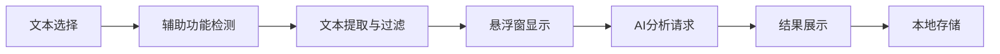

# ReadAssist - 智能阅读助手

<div align="center">
  
  
  <h3>专为墨水屏设备设计的AI阅读助手</h3>
  
  [](https://android.com)
  [](https://kotlinlang.org)
  [](LICENSE)
  [](https://android-arsenal.com/api?level=21)
</div>

## 📖 项目简介

ReadAssist 是一个专为墨水屏设备设计的智能阅读助手应用，**现已增加对掌阅设备的全面支持**！通过先进的截屏识别技术和AI分析能力，为用户提供无缝的阅读体验和智能内容解析。

### ✨ 核心特性

- 📱 **掌阅设备专项支持** - 全面支持掌阅电纸书设备，截屏后自动触发AI对话
- 📸 **智能截屏分析** - 通过截屏图片与AI对话，充分发挥电纸书的手写优势
- ✍️ **手写识别** - AI能读懂您的手画重点和批注，让学习更高效
- 🎛️ **灵活发送选项** - 发送问题时可选是否附带截屏图片和剪贴板内容，自主性更强
- 🤖 **推荐AI配置** - 建议使用Google Gemini 2.5 Flash，可申请免费API，每日500次免费调用额度
- 🎈 **悬浮窗交互** - 优雅的悬浮按钮和聊天窗口，不干扰阅读体验
- 📱 **墨水屏优化** - 专为E-ink显示屏优化的UI设计和交互逻辑
- 💾 **本地数据存储** - 聊天记录本地保存，支持历史查询和导出

### 🎯 支持的设备与应用

#### 📱 掌阅设备
- **掌阅 X3 Pro** - 🔥 **强烈推荐：将上翻页键长按设置为截屏，体验最佳**
- **掌阅其他带翻页键设备** - 同样建议设置翻页键长按截屏
- **支持所有掌阅原生应用和第三方阅读应用**

#### 📚 其他设备与应用
- **Supernote A5 X2** (`com.supernote.document`) - 主要支持
- **Supernote Launcher** (`com.ratta.supernote.launcher`)
- **Adobe Reader** (`com.adobe.reader`)
- **WPS Office** (`com.kingsoft.moffice_eng`)

## 🚀 快速开始

### 系统要求

- Android 5.0 (API 21) 或更高版本
- 推荐设备：Supernote A5 X2 或其他墨水屏平板
- 网络连接（用于AI分析功能）

### 安装方式

#### 方式一：直接安装APK
1. 从 [Releases](https://github.com/James-Zhu-CA/ReadAssist/releases) 页面下载最新版本APK
2. 在设备上启用"未知来源"安装
3. 安装APK文件

#### 方式二：从源码构建
```bash
# 克隆项目
git clone https://github.com/James-Zhu-CA/ReadAssist.git
cd ReadAssist

# 构建并安装（需要连接Android设备）
./build_and_install.sh
```

### 初始配置

1. **授予权限**
   - 悬浮窗权限：用于显示AI助手界面
   - 辅助功能权限：用于获取文本内容
   - 网络权限：用于AI API调用

2. **设置API Key**
   - 获取 [Google Gemini API Key](https://makersuite.google.com/app/apikey)
   - 在应用设置中输入API Key

3. **启动服务**
   - 在主界面点击"启动服务"
   - 确保所有权限已正确授予

## 🎮 使用方法

### 🔥 掌阅设备推荐使用流程

1. **设置翻页键截屏**
   - 进入掌阅设备设置，将**上翻页键长按**设置为截屏功能
   - 这样能获得最佳的使用体验！

2. **启动ReadAssist服务**
   - 打开应用，完成权限授予和API配置

3. **开始智能阅读**
   - 打开任意阅读应用或PDF文档
   - 遇到需要分析的内容时，**长按上翻页键截屏**
   - ReadAssist会自动弹出AI对话窗口
   - 选择是否附带截屏图片和剪贴板内容
   - 获得AI智能分析，包括手写批注识别

### 📚 通用设备使用流程

1. **启动ReadAssist服务**
2. **打开支持的阅读应用**
3. **选择文本内容或进行截屏**
4. **点击悬浮按钮** - 进入AI分析界面
5. **灵活选择发送内容** - 可选截屏图片、剪贴板内容
6. **获取智能分析** - AI会分析文本和图像内容

### 🎯 推荐AI配置

**强烈推荐使用 Google Gemini 2.5 Flash：**
- ✅ **免费额度充足**：每日500次免费调用
- ⚡ **响应速度快**：Flash版本优化了响应时间
- 🧠 **分析能力强**：能识别手写内容和图像中的文字
- 🔗 **申请地址**：[Google AI Studio](https://aistudio.google.com)

### 🛠️ 高级功能

- **智能截屏分析**：AI能识别手写批注、重点标记
- **多模态内容发送**：灵活选择文字、图片、剪贴板组合
- **自动触发模式**：截屏后自动弹出对话窗口
- **历史记录管理**：查看、搜索和导出聊天历史
- **收藏功能**：收藏重要的分析结果

## 🏗️ 技术架构

### 核心组件

```
ReadAssist/
├── 🎯 TextAccessibilityService    # 辅助功能服务 - 文本检测和提取
├── 🎈 FloatingWindowService       # 悬浮窗服务 - UI交互管理
├── 📸 ScreenshotService          # 截屏服务 - 屏幕内容捕获
├── 🗄️ Room Database              # 本地数据存储
├── 🌐 Retrofit + OkHttp          # 网络请求处理
└── 🎨 Material Design UI         # 现代化用户界面
```

### 文本提取策略

应用采用三层文本提取策略，确保准确获取用户选中的内容：

1. **选中状态检测** - 查找具有选中状态的UI节点
2. **内容区域分析** - 从ImageView、TextView、WebView等组件提取
3. **智能过滤** - 过滤UI元素和元数据，保留正文内容

### 数据流程



## 🛠️ 开发指南

### 开发环境设置

```bash
# 克隆项目
git clone https://github.com/James-Zhu-CA/ReadAssist.git
cd ReadAssist

# 使用Android Studio打开项目
# 或使用命令行构建
./gradlew assembleDebug
```

### 调试工具

项目提供了便捷的调试脚本：

```bash
# 监听文本选择事件（默认模式）
./monitor_logs.sh

# 监听所有应用事件
./monitor_logs.sh all

# 简化输出模式
./monitor_logs.sh simple
```

### 日志标识说明

| 标识 | 含义 |
|------|------|
| 🚀🚀🚀 | 服务启动和连接 |
| 🔥🔥🔥 | Supernote特定事件 |
| 📊📊📊 | 文本候选信息 |
| 📝📝📝 | 实际文本内容 |
| 🎯🎯🎯 | 文本选择状态 |

详细开发文档请参考 [DEVELOPMENT.md](DEVELOPMENT.md)

## 📁 项目结构

```
ReadAssist/
├── app/
│   ├── src/main/java/com/readassist/
│   │   ├── ui/                    # UI组件
│   │   │   ├── MainActivity.kt
│   │   │   ├── SettingsActivity.kt
│   │   │   └── ScreenshotPermissionActivity.kt
│   │   ├── service/               # 核心服务
│   │   │   ├── TextAccessibilityService.kt
│   │   │   ├── FloatingWindowService.kt
│   │   │   └── ScreenshotService.kt
│   │   ├── repository/            # 数据仓库
│   │   ├── database/              # 数据库相关
│   │   ├── network/               # 网络请求
│   │   ├── model/                 # 数据模型
│   │   ├── utils/                 # 工具类
│   │   └── viewmodel/             # ViewModel
│   └── src/main/res/              # 资源文件
├── build_and_install.sh           # 构建安装脚本
├── monitor_logs.sh                # 日志监听脚本
├── DEVELOPMENT.md                 # 开发文档
└── README.md                      # 项目说明
```

## 🔧 配置选项

### API配置

在应用设置中可以配置：

- **Gemini API Key**：Google AI服务密钥
- **提示模板**：自定义AI分析提示词
- **自动分析**：是否在文本选择时自动分析

### 高级设置

开发者可以在代码中调整：

- 文本过滤规则
- 选择检测灵敏度
- 悬浮窗行为
- 日志输出级别

## 🤝 贡献指南

我们欢迎社区贡献！请遵循以下步骤：

1. **Fork** 本项目
2. **创建特性分支** (`git checkout -b feature/AmazingFeature`)
3. **提交更改** (`git commit -m 'Add some AmazingFeature'`)
4. **推送到分支** (`git push origin feature/AmazingFeature`)
5. **创建Pull Request**

### 贡献规范

- 遵循现有的代码风格和命名规范
- 添加适当的日志输出便于调试
- 更新相关文档说明
- 确保在Supernote设备上的兼容性

## 📄 许可证

本项目采用 MIT 许可证 - 查看 [LICENSE](LICENSE) 文件了解详情。

## 🙏 致谢

- [Google Gemini API](https://ai.google.dev/) - 提供强大的AI分析能力
- [Supernote](https://supernote.com/) - 优秀的墨水屏设备
- [Android Accessibility API](https://developer.android.com/guide/topics/ui/accessibility) - 无障碍功能支持

## 📞 联系方式

- **项目主页**：[GitHub Repository](https://github.com/James-Zhu-CA/ReadAssist)
- **问题反馈**：[Issues](https://github.com/James-Zhu-CA/ReadAssist/issues)
- **功能建议**：[Discussions](https://github.com/James-Zhu-CA/ReadAssist/discussions)

---

<div align="center">
  <p>如果这个项目对您有帮助，请给我们一个 ⭐️</p>
  <p>Made with ❤️ for E-ink Reading Experience</p>
</div>

## 最新更新 (v1.1.0)

我们最近完成了应用的重大架构重构，对核心服务进行了模块化设计：

- **模块化架构**：将近3000行的`FloatingWindowService`拆分为7个专注于特定功能的管理器类
- **代码质量提升**：实现高内聚、低耦合设计，提高可维护性和可读性
- **更高效的开发**：更容易添加新功能和修复问题
- **无缝过渡**：保持相同的用户体验，用户无感知升级

详细信息请查看[版本说明文档](VERSION_NOTES.md)和[开发者指南](DEVELOPER_GUIDE.md)。

## 功能特点

- 智能文本选择检测：支持多种阅读应用和文件类型
- AI内容分析：集成Google Gemini和SiliconFlow API
- 悬浮窗交互界面：优雅的悬浮按钮和聊天窗口
- 截屏分析：捕获屏幕内容进行AI分析
- 本地数据存储：保存聊天记录和设置
- 墨水屏优化：专为E-ink屏幕设计的UI

## 安装说明

1. 确保您的设备已启用"未知来源"应用安装
2. 下载最新APK文件
3. 安装应用并完成设置

## 使用指南

1. 启动应用并授予必要权限
2. 配置AI服务（Gemini或SiliconFlow）
3. 打开任意阅读应用
4. 使用悬浮按钮与AI助手交互

## 开发信息

- 语言：Kotlin
- 最低支持Android版本：5.0 (API 21)
- 架构模式：MVVM + 模块化管理器

## 许可证

本项目采用 MIT 许可证 